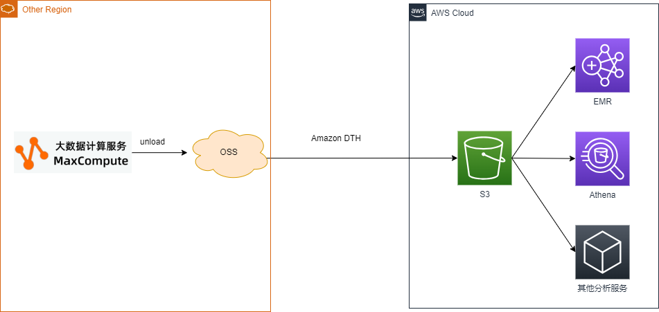
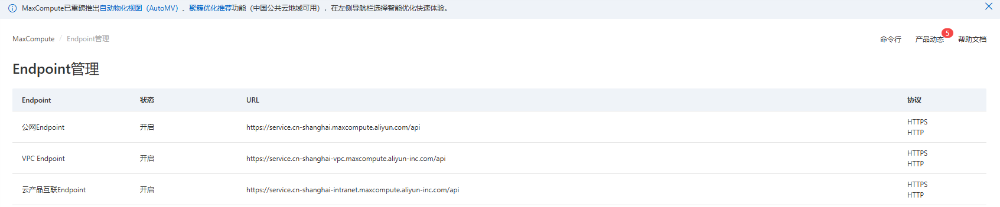
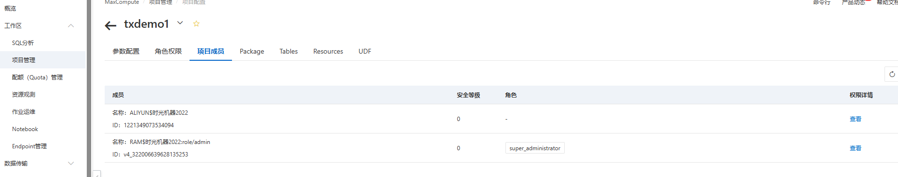

# maxcompute-migration
## 简介
项目使用maxcompute 的[unload](https://help.aliyun.com/zh/maxcompute/user-guide/product-unload-dml)命令，按分区，并发把表中的数据导出到oss,后续可以利用dth一类工具将数据复制到其他云平台


## 配置
注意 *配置前请先仔细阅读.env文件*
### 配置 maxendpoint 参数
1. 在maxcompute 控制台复制好endpoint参数，如果代码打算在vpc内执行，则建议选择vpc endpoint

2. 参考注释，修改 .env 文件的 TARGET_ENDPOINT

### 配置 ROLE 参数
1. .env文件的ROLE参数用于maxcompute导出数据到oss,所以必须被maxcompute 使用，并且有权限写入oss

### 配置 AK,SK 参数
```
# 如果所在的执行环境没有绑定拥有权限的的角色，则需要配置AK, SK,这个用户必须加入maxcompute 项目
ALIYUN_AK=ak
ALIYUN_SK=sk
```
AK, SK对应的用户必须加入maxcompute 项目


## 运行
```
pip install -r requirement.txt

python3 app.py
```
